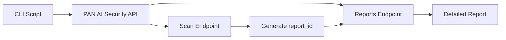

# 🛡️ Palo Alto Networks AI Security Report Retriever

<div align="center">


**A python tool for retrieving threat scan reports from Palo Alto Networks Prisma AIRS - AI Runtime Security API**

[Features](#features) • [Installation](#installation) • [Usage](#usage) • [API Documentation](#api-documentation)

</div>

---

## ✨ Features

- 🔍 **Test API Endpoints** - Validate connectivity and permissions
- 🚀 **Generate Test Scans** - Create sample scans for testing
- 📊 **Full Workflow Testing** - End-to-end scan → report retrieval
- 📋 **Bulk Report Retrieval** - Fetch multiple reports by ID
- 🎨 **Rich CLI Interface** - Beautiful terminal output with status indicators
- ⚡ **Fast & Reliable** - Optimized API calls with proper error handling

## 🚀 Quick Start

### Prerequisites

```bash
# Python 3.8 or higher
python --version

# Required packages
pip install requests python-dotenv
```

### Installation

1. **Clone or download the script**
   ```bash
   curl -O https://raw.githubusercontent.com/airs_report_fetch/get_report.py
   ```

2. **Set up environment variables**
   ```bash
   # Create .env file
   cat > .env << EOF
   PANW_AI_SEC_API_KEY=your_api_key_here
   PANW_AI_SEC_PROFILE=your_profile_name
   PANW_AI_SEC_ENDPOINT=https://service.api.aisecurity.paloaltonetworks.com
   EOF
   ```

3. **Run the script**
   ```bash
   python3 get_report.py
   ```

## 📖 Usage

### Interactive Menu

```bash
$ python3 get_report.py

============================================================
🛡️  Palo Alto Networks AI Security Report Retriever - WORKING
============================================================

Choose an option:
1. Test scan endpoint (generate test scan)
2. Test both scan + reports (full workflow)  
3. Get specific report by ID
4. Exit
```

### Option 1: Test Scan Endpoint
Generate a test scan to validate your API configuration:
```bash
Enter your choice (1-4): 1
```
- ✅ Validates API key and profile
- 🔍 Shows request/response details
- 📋 Returns report_id for further testing

### Option 2: Full Workflow Test
Complete end-to-end testing:
```bash
Enter your choice (1-4): 2
```
- 🚀 Generates test scan
- 📊 Retrieves detailed report
- ✨ Validates entire workflow

### Option 3: Get Specific Reports
Retrieve reports by ID:
```bash
Enter your choice (1-4): 3
Enter report ID(s) (comma-separated): R7b8ab596-cfac-0000-aaf7-1fecba5505d3
```
- 📋 Supports multiple report IDs
- 🔍 Shows detailed report data
- ⚡ Handles errors gracefully

## ⚙️ Configuration

### Environment Variables

| Variable | Description | Default |
|----------|-------------|---------|
| `PANW_AI_SEC_API_KEY` | Your Palo Alto Networks API key | Required |
| `PANW_AI_SEC_PROFILE` | Security profile name | `advancedtest` |
| `PANW_AI_SEC_ENDPOINT` | API endpoint URL | `https://service.api.aisecurity.paloaltonetworks.com` |

### Example .env File

```bash
# Palo Alto Networks AI Runtime Security Configuration
PANW_AI_SEC_API_KEY=n36PY8mblqIpljRVinySNrp4bAUstchBwc5ht6I1Ti3xfned
PANW_AI_SEC_PROFILE=my-security-profile
PANW_AI_SEC_ENDPOINT=https://service.api.aisecurity.paloaltonetworks.com

# Optional: Debug mode
DEBUG_MODE=false
```

## 🔧 API Endpoints

This script interacts with the following Palo Alto Networks AI Runtime Security endpoints:

### Scan Endpoint
```http
POST /v1/scan/sync/request
```
**Purpose**: Generate security scans and obtain report IDs

**Headers**:
- `x-pan-token`: Your API key
- `Content-Type`: application/json

**Payload**:
```json
{
  "tr_id": "unique-transaction-id",
  "ai_profile": {"profile_name": "your-profile"},
  "metadata": {
    "app_user": "username",
    "ai_model": "model-name",
    "app_name": "application-name"
  },
  "contents": [{"prompt": "text-to-scan"}]
}
```

### Reports Endpoint
```http
GET /v1/scan/reports?report_ids=<report_id>
```
**Purpose**: Retrieve detailed threat scan reports

**Headers**:
- `x-pan-token`: Your API key
- `Accept`: application/json

## 📊 Sample Output

### Successful Scan Generation
```bash
🔍 Testing scan endpoint with proper payload...
URL: https://service.api.aisecurity.paloaltonetworks.com/v1/scan/sync/request

Status Code: 200
✅ Scan successful!

📋 Got report_id: R7b8ab596-cfac-0000-aaf7-1fecba5505d3
```

### Report Retrieval
```json
{
  "action": "allow",
  "category": "benign",
  "profile_id": "4597dc2b-xxxx-4e5a-a1da-fd0fe0e948df",
  "profile_name": "my-profile",
  "prompt_detected": {
    "dlp": false,
    "injection": false,
    "url_cats": false
  },
  "response_detected": {},
  "report_id": "R7b8ab596-cfac-0000-aaf7-1fecba5505d3",
  "scan_id": "7b8ab596-cfac-0000-aaf7-1fecba5505d3",
  "tr_id": "test-20241220-143022"
}
```

## 🐛 Troubleshooting

### Common Issues

#### 403 Forbidden
```bash
❌ Forbidden - check API permissions
```
**Solution**: Verify your API key has the correct permissions in Strata Cloud Manager

#### 400 Bad Request - Profile Missing
```bash
❌ Error: "neither profile ID nor profile name is present"
```
**Solution**: Check your `PANW_AI_SEC_PROFILE` environment variable

#### Connection Errors
```bash
❌ Connection error: HTTPSConnectionPool...
```
**Solution**: Check network connectivity and proxy settings

### Debug Mode

Enable detailed logging:
```bash
export DEBUG_MODE=true
python3 get_report.py
```

## 🏗️ Architecture



## 📚 API Documentation

- [Palo Alto Networks AI Runtime Security API](https://pan.dev/prisma-airs/api/airuntimesecurity/)
- [Use Cases and Examples](https://pan.dev/ai-runtime-security/api/usecases/)
- [Strata Cloud Manager Documentation](https://docs.paloaltonetworks.com/strata-cloud-manager)

## 🤝 Contributing

1. Fork the repository
2. Create a feature branch (`git checkout -b feature/amazing-feature`)
3. Commit your changes (`git commit -m 'Add amazing feature'`)
4. Push to the branch (`git push origin feature/amazing-feature`)
5. Open a Pull Request

## 📝 License

This project is licensed under the MIT License - see the [LICENSE](LICENSE) file for details.

## 🙏 Acknowledgments

- [Palo Alto Networks](https://www.paloaltonetworks.com/) for the AI Runtime Security platform
- [Requests](https://docs.python-requests.org/) library for HTTP handling
- [Python-dotenv](https://github.com/theskumar/python-dotenv) for environment management

---

<div align="center">

**Made with ❤️ for cybersecurity professionals**

[Report Bug](https://github.com/airs_report_fetch/issues) 

</div>
